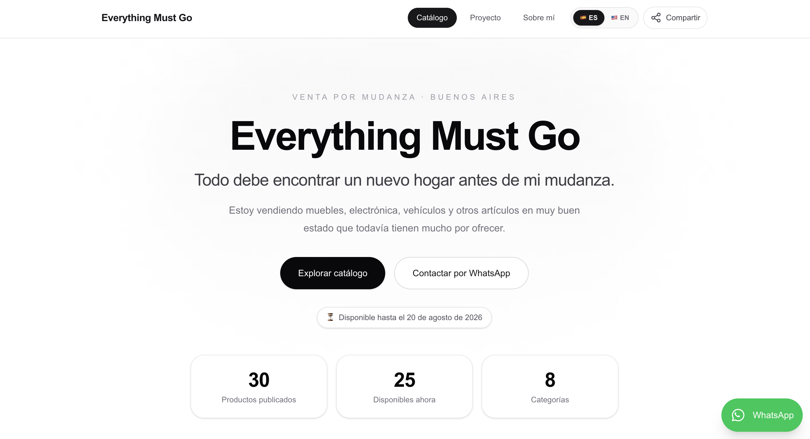
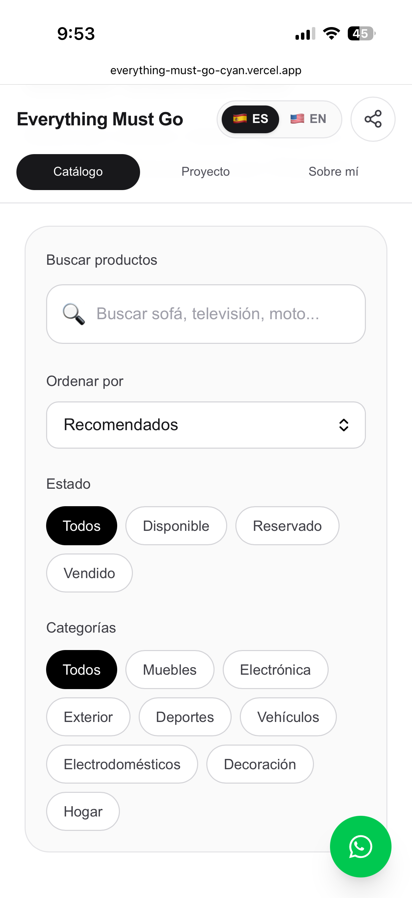
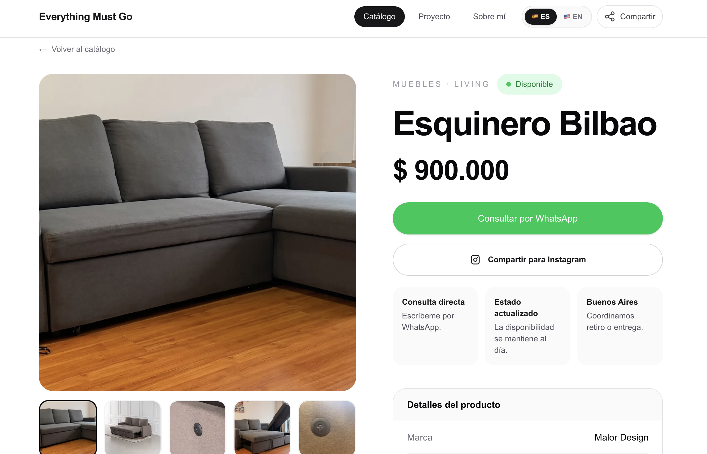

# Everything Must Go

A bilingual, production-ready catalog built to manage a real moving sale in Buenos Aires.

[Live catalog](https://everything-must-go-cyan.vercel.app/es) · [Case study](https://everything-must-go-cyan.vercel.app/en/proyecto) · [Spanish case study](https://everything-must-go-cyan.vercel.app/es/proyecto)



| Mobile catalog | Product detail |
|---|---|
|  |  |

## The problem

Managing dozens of products through messages and isolated posts makes availability, prices, photos, and buyer conversations difficult to keep consistent. Everything Must Go turns a Google Sheet into a searchable public catalog with direct, product-specific WhatsApp contact.

The project is used with real inventory. Products can be marked as available, reserved, or sold without editing application code.

## Product highlights

- Search, category filters, sorting, and related products.
- Individual product pages with image galleries and keyboard navigation.
- Direct WhatsApp inquiries with the product and tracked URL prefilled.
- Available, reserved, sold, free, and price-on-request states.
- Spanish and English routes with localized content and pricing references.
- Shareable catalog and product Story assets.
- Campaign links for WhatsApp, Instagram, TikTok, Marketplace, LinkedIn, and referrals.
- Responsive layout and keyboard-accessible interactions.

## Architecture

```text
Google Sheets
      ↓
CSV import and validation
      ↓
Generated catalog JSON
      ↓
Next.js App Router
      ↓
Vercel deployment
```

Google Sheets is the operational source of truth. The import script reads only the public inventory fields needed by the application and generates `data/catalog.json`. Secrets and private Sheet values are excluded from the repository and build logs.

## Stack

- Next.js 16 and React 19
- TypeScript
- Tailwind CSS 4
- Google Sheets as inventory source
- Vercel Web Analytics and Speed Insights
- Vercel deployment

## SEO, analytics, and quality

- Localized titles and descriptions.
- Canonical URLs and ES/EN `hreflang` alternates.
- Dynamic product metadata.
- Open Graph and Twitter Card previews.
- `Product`, `BreadcrumbList`, and `Person` structured data.
- Generated sitemap and robots rules.
- Privacy-conscious page analytics and campaign UTMs.
- Lighthouse validation reached 100 for accessibility and SEO; recorded performance scores were 95 on mobile and 99 on desktop during Sprint 7 QA.
- Production build, TypeScript, ESLint, responsive, keyboard, and critical-flow checks.

## Local development

Requirements:

- Node.js 20 or newer
- npm
- A readable Google Sheet exposing the inventory CSV used by the importer

Install dependencies:

```bash
npm install
```

Create the local environment file from the safe example:

```bash
cp .env.example .env.local
```

Then replace the placeholders in `.env.local`:

```text
GOOGLE_SHEET_ID=your_sheet_id
GOOGLE_SHEET_GID=your_sheet_tab_gid
```

The Sheet used for imports should expose only the inventory required by the catalog. Keep credentials, private notes, internal costs, and personal data out of any publicly readable source.

Start the development server:

```bash
npm run dev
```

## Available scripts

| Command | Purpose |
|---|---|
| `npm run dev` | Start the local development server |
| `npm run import` | Import the current inventory from Google Sheets |
| `npm run build` | Synchronize inventory and create a production build |
| `npm run lint` | Run ESLint |
| `npm run check` | Run lint and the Next.js build |
| `npm run campaign:links` | Generate tracked campaign links |

Generate channel-specific links for one product:

```bash
npm run campaign:links -- --product EMG-0002
```

## Project structure

```text
app/                  Routes, metadata, sitemap, robots, and API handlers
components/           Catalog, gallery, sharing, navigation, and UI components
data/catalog.json     Generated public inventory
docs/marketing/       Campaign system, launch kit, and content strategy
lib/                  Configuration, localization, pricing, SEO, and UTM helpers
public/               Brand, product, project, and CV assets
scripts/              Inventory import and campaign-link generation
```

## Product decisions

- Google Sheets remains the source of truth because it lets the owner update inventory without a custom admin panel.
- WhatsApp is the primary conversion because buyers need to coordinate condition and handoff directly.
- Sold products remain visible to communicate real inventory status while guiding visitors to available alternatives.
- Analytics avoids collecting names, phone numbers, message contents, or other unnecessary personal data.
- Urgency is tied to the real moving date and is not manufactured.

## Roadmap

- Per-product seller ownership and WhatsApp routing.
- A privacy-safe launch dashboard with aggregated inventory, traffic, campaign, and conversion results.
- Conversion experiments based on observed traffic and inquiries.
- Reusable catalog offering for other sellers and small businesses.

## Author

Designed and developed by [Cristina García Mijares](https://www.linkedin.com/in/cristina-garcia-mijares/).

## Usage

This repository is currently shared as a portfolio case study. No license granting reuse or redistribution has been added.
